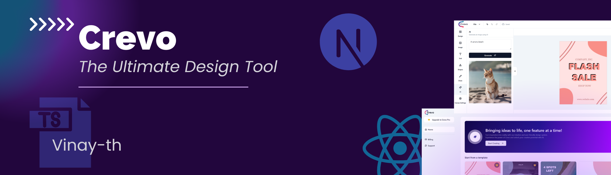
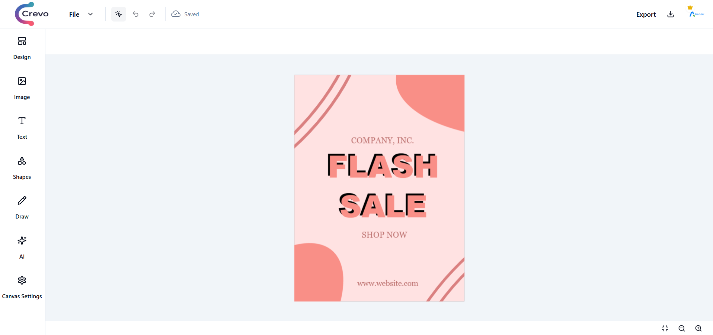
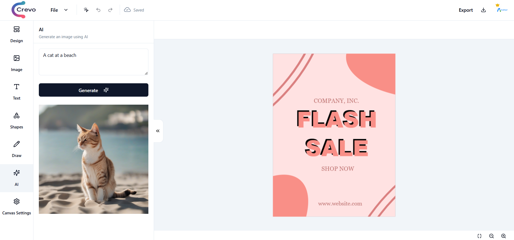
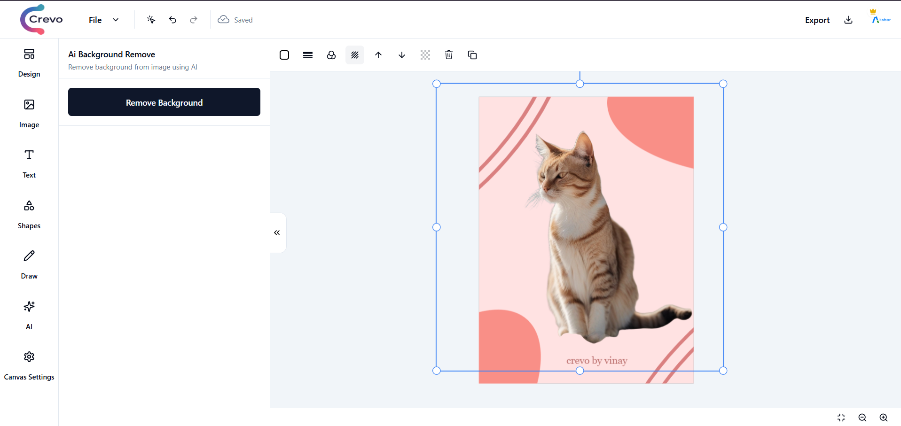
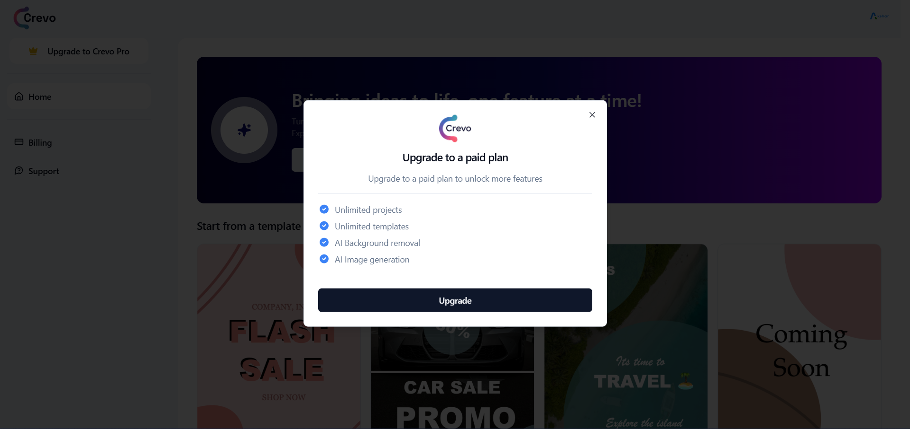
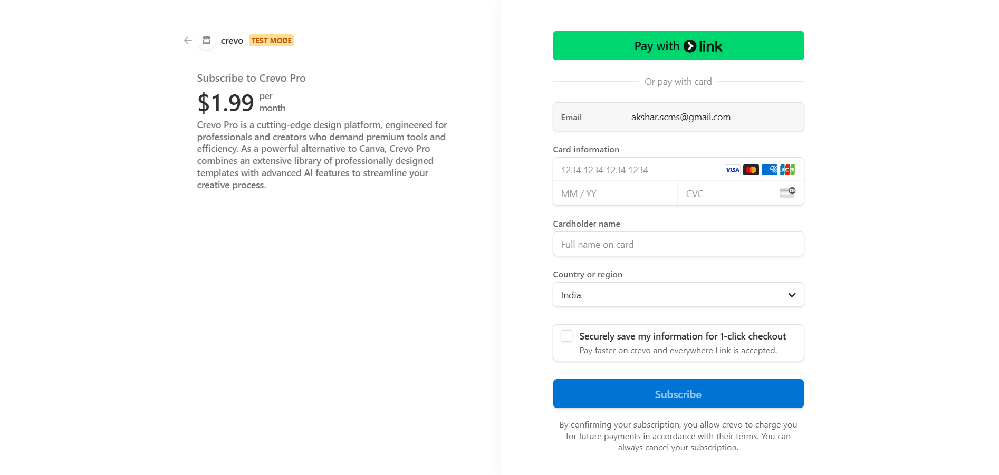

# 🚀 **Crevo** - _The Ultimate Design Tool_ 🎨

> **Inspired by Canva** | A modern, full-stack, mini SaaS project for graphic design.

## 

## 🌟 **Overview**

**Crevo(Creative Evolution)** is a powerful, intuitive, and feature-rich **design editor** built for creators of all levels. Whether you're designing social media graphics, presentations, or personal projects, **Crevo** brings a seamless editing experience to your fingertips.

### Check out the [**demo**](https://crevo-gamma.vercel.app/) to see what it can do!

🛠️ _Tech-Stack:_ **Next.js, hono.js, TailwindCSS, Stripe, Stable Diffusion XL**, and more.  
🎯 _Mission:_ Make graphic design simple, collaborative, and powered by AI.

---

## 🖥️ **Screenshots**

### 1️⃣ **Main Editor Interface**

  
_A clean and intuitive design workspace with tools for text, shapes, and images._

### 2️⃣ **AI Image Generation**

  
_Use Cloudflare's Stable Diffusion API to generate stunning images with a single click._

### 3️⃣ **AI Background Removal**

  
_Seamlessly remove image backgrounds using Bria AI._

### 4️⃣ **Payments & Subscriptions**

   
_Easily manage payments and subscriptions via Stripe._

---

## ✨ **Features**

| **Feature**                      | **Description**                                                                             |
| -------------------------------- | ------------------------------------------------------------------------------------------- |
| 🖼️ **Intuitive Templates**       | Pre-designed templates to jumpstart your design projects.                                   |
| 🎨 **Text Tool Enhancements**    | Supports **custom Google fonts**, styles, alignment, and more.                              |
| 📏 **Shape Customization**       | Easily manipulate and customize shapes.                                                     |
| 🖌️ **Freehand Drawing**          | Draw freely with an intuitive **freehand drawing tool**.                                    |
| 🔄 **Undo/Redo History**         | Comprehensive undo and redo support for mistake-free workflows.                             |
| 📡 **Real-Time Autosave**        | Your progress is saved automatically, no more lost work!                                    |
| 🔒 **Authentication**            | Secure **Next-Auth v5** with OAuth for GitHub and Google login.                             |
| 🌟 **AI Image Generation**       | Generate images via **Stable Diffusion XL** using Cloudflare's API.                         |
| 🧹 **AI Background Removal**     | Remove image backgrounds with ease using **Bria AI**.                                       |
| 💳 **Payments & Subscriptions**  | Manage subscriptions and payments seamlessly via **Stripe**.                                |
| 📤 **Project Export Options**    | Export your designs as **PNG, SVG, JPG, or JSON** formats.                                  |
| 🚀 **Powered by Next.js**        | A blazing-fast frontend experience.                                                         |
| 🔥 **Hono.js API**               | Efficient and modern API built with **Hono.js**.                                            |
| 🛢️ **Postgres Database**         | Managed database powered by **NeonDB**.                                                     |
| 🌐 **ORM with DrizzleORM**       | A modern and lightweight **ORM** for database operations.                                   |
| 🎨 **UI Built with TailwindCSS** | Beautiful, customizable UI built with **TailwindCSS**, **Shadcn UI** and **Aceternity UI**. |

---

## 🛠️ **Tech Stack**

<div align="center">
  


</div>

---

## 📦 **Installation**

1. **Clone the Repository**:

   ```bash
   git clone https://github.com/vinay-th/crevo.git
   cd crevo
   ```

2. **Install Dependencies**:

   ```bash
   npm install
   ```

3. **Set Up Environment Variables**:  
   Create a `.env` file and provide the required API keys and credentials:

   ```env
   DATABASE_URL=YOUR_NEONDB_URL
   NEXTAUTH_URL=YOUR_NEXTAUTH_URL
   STRIPE_API_KEY=YOUR_STRIPE_KEY
   CLOUDFLARE_API_KEY=YOUR_CLOUDFLARE_KEY
   BRIA_API_KEY=YOUR_BRIA_KEY
   ```

4. **Start the Development Server**:
   ```bash
   npm run dev
   ```

---

## 💳 **Payments & Subscriptions**

- **Stripe Integration** for managing user subscriptions and payments.
- Supports recurring payments and one-time charges.

---

## 🌟 **AI Features**

### 🖼️ **Image Generation**

Leverages **Cloudflare's Stable Diffusion XL API** for stunning AI-powered image creation.

### 🧹 **Background Removal**

Uses **Bria AI** to automatically remove backgrounds from images.

---

## 🔒 **Authentication**

- Secure **NextAuth v5** implementation.
- Supports OAuth with **GitHub** and **Google** for seamless user authentication.

---

## 📤 **Export Options**

- Export projects in multiple formats:
  - **PNG**
  - **SVG**
  - **JPG**
  - **JSON**

---

## 🚀 **Roadmap**

- 🗂️ **Team Collaboration**: Real-time collaboration for teams.
- 📆 **Custom Templates Library**: User-uploaded template storage.
- 📈 **Analytics Dashboard**: Track project views and stats.
- 🖼️ **Image Library**: Built-in stock image search and assets.

---

## 🤝 **Contributing**

We love contributions! If you'd like to improve **Crevo**, fork the repository and open a pull request 🚀.

---

## 📜 **License**

This project is licensed under the **MIT License**.

---

## 🎯 **Credits**

- **Stable Diffusion XL API** by Cloudflare.
- **Background Removal** by Bria AI.
- UI Components built with **TailwindCSS** and **Shadcn UI**.
- UI Design inspired by a Figma community design 

---

## 🌐 **Connect**

- **GitHub**: [@vinay-th](https://github.com/vinay-th)
- **Twitter**: [@code-with-vinay](https://x.com/code_with_vinay)
- **LinkedIn**: [@vinay-thakor](https://www.linkedin.com/in/vinay-thakor/)

---

🚀 **Crevo** is the ultimate tool to unleash your creativity. Start designing today! 🎨

---

What do you think? Does this fully capture your vision for **Crevo**? 🎉 Let me know if you'd like tweaks or further improvements! 🚀

---

<div align="center">
  <h3>Built with ❤️ by Vinay</h3>
</div>
